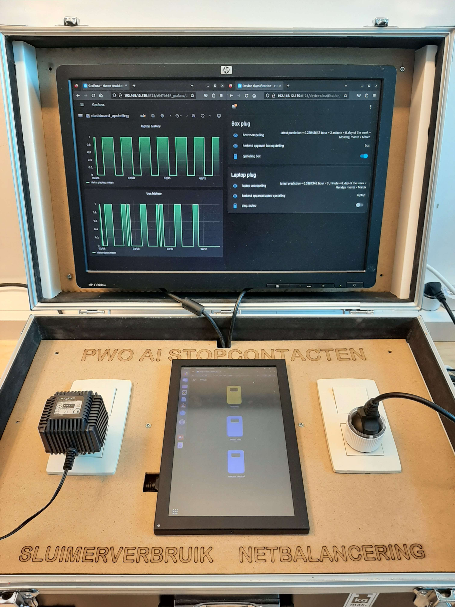
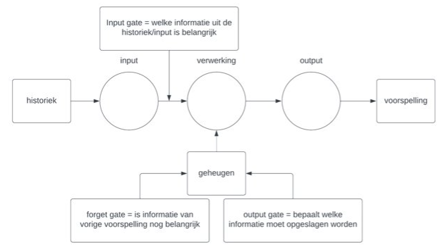

# Ontwikkelen van een AI-stopcontact

De doelstelling van deze bachelorproef was om op een innovatieve manier het sluimerverbruik van apparaten te verminderen. Hiervoor werd er gebruik gemaakt van artificiële intelligentie. De AI zal eerst het verbonden apparaat herkennen en zal daarna het gebruikersgedrag bepalen, zodat het kan weten wanneer het stopcontact mag uitgezet worden. Ten slotte werd er een opstelling gemaakt waarop alles te zien is en ook volledig bediend kan worden met een touchscreen.

  

## Samenvatting

Ten eerste werd onderzoek uitgevoerd naar het sluimerverbruik van apparaten. Om een stopcontact automatisch aan en uit te zetten moet het sluimerverbruik namelijk duidelijk onderscheidbaar zijn van het normaal verbruik.

- [onderzoek sluimerverbruik](./extra_markdowns/onderzoek_sluimerverbruik.md)

De artificiële intelligentie zal eerst en vooral gaan herkennen welk toestel er zich momenteel bevindt in het stopcontact. Om het toestel te herkennen wordt gebruik gemaakt van een simpel classificatiemodel. Dit model herkent apparaten aan de hand van het effectief vermogen, reactief vermogen, actief vermogen en de stroom. Van deze parameters worden een bepaald aantal samples genomen die als input van het model dienen. Dit model kan slechts een gelimiteerd aantal apparaten herkennen. Hoe meer apparaten het model moet kunnen herkennen hoe slechter de predictie wordt. Om dit probleem op te lossen kan het aantal samples data dat genomen wordt vergroot worden of kan gebruik gemaakt worden van een LSTM sequence classificatie model.

Daarna wordt het gebruikersgedrag opgenomen, omdat de AI hiermee een aangeleerd patroon kan herkennen. Vervolgens zal de AI aan de hand van het herkende patroon een voorspelling maken van de volgende status van het stopcontact. Aan de hand hiervan kan het stopcontact automatisch aan en uitgezet worden. Voor deze AI werd gebruik gemaakt van een LSTM (Long Short Term Memory) model.

  

Een LSTM model neemt als input een historiek. Deze historiek kan bestaan uit één of meerdere parameters. Voor ons model werd gebruik gemaakt van de dag van de week, het uur, de minuut en de status op dat moment. Om uit deze historiek te leren wordt in een LSTM model gebruik gemaakt van drie gates. Ten eerste bepaald de input gate welke informatie uit de gekregen historiek belangrijk is voor de voorspelling. Ten tweede bepaald de forget gate welke informatie van vorige voorspellingen nog belangrijk is en dus wel of niet uit het geheugen mag verwijderd worden. Ten laatste bepaalt de output gate welke informatie van de huidige voorspelling opgeslagen moet worden.

Om ervoor te zorgen dat het LSTM model voor meerdere apparaten een patroon kan herkennen en voorspellen werd een "apparaat"-parameter toegevoegd. De waarde van deze parameter wordt bepaald aan de hand van het classificatie model en staat het model ertoe in staat om verschillende apparaten van elkaar te onderscheiden.

Het ontwikkelde model is er toe in staat om voor een printer, opladende gsm, laptop, pc en speaker een voorspelling te maken. Het model werd voor elk van deze apparaten één patroon aangeleerd. Om ervoor te zorgen dat de voorspellingen van het model voldoende vlug veranderingen vertonen, werden de hoeken van het patroon waarmee geleerd wordt afgerond. Om het model uit te breiden kunnen meer apparaten toegevoegd worden en moet een methode gevonden worden om voor elk apparaat meerdere patronen aan te leren.

Ten slotte werd een opstelling gemaakt die de volledige werking van de bachelorproef kan tonen.

## Extra's

- [verdere uitbreidingsmogelijkheden](./extra_markdowns/uitbreiding.md)

- [korte uitleg over notebooks & scripts](./extra_markdowns/notebooks_scripts.md)

- [home assistant setup & tasmota](./extra_markdowns/home_assistant_tasmota_setup.md)

- [complete opstelling & setup](./extra_markdowns/opstelling.md)

- [installatie en uitvoering van model/scripts](./extra_markdowns/installatie_uitvoering.md)

## Auteurs

[ Lukas Hoste](https://github.com/LukasHoste)

[ Jarno Mechele](https://github.com/JarnoMechele)
