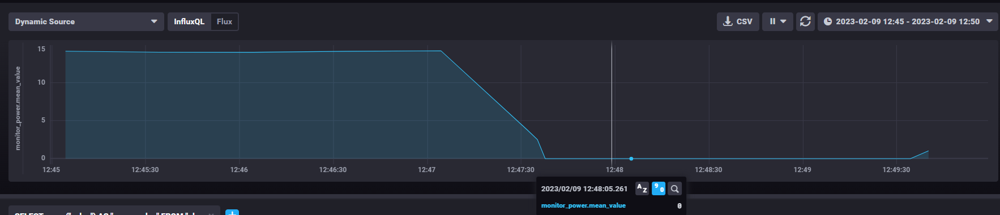
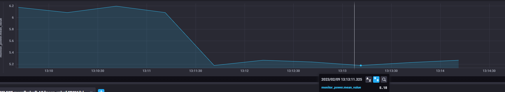
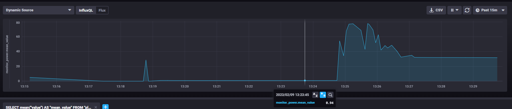
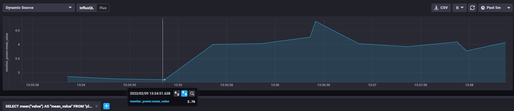

# SlimmeStopcontactenVIVES

## Classificatie geteste optimizers

- sgd = niet goed, loss verandert niet goed
- adagrad = niet goed, loss verandert vrijwel niet
- RMSprop = werkt redelijk, maar ook niet echt goed, de loss bereikt nooit een uitstekende waarde
- adam = werkt goed, bereikt vaker een goede waarde dan andere optimizers
- adamax = werkt redelijk, beetje beter dan RMSprop, loss wordt wel niet super goed
- FTRL = werkt goed, loss verlaagt traag, maar verlaagt wel telkens, mss goed met heel veel epochs
- nadam = werkt redelijk, gelijkaardig aan RMSprop

## Home assistant setup

### MQTT broker

1. Install Mosquitto broker in de Add-on store.
2. Ga naar integrations en klik bij de MQTT integration op configure, klik op re-configure en voer de instellingen van je broker in.
3. Indien de broker op home assistant loopt kan MQTT explorer gebruikt worden om te testen of de broker werkt.

### Oplossing Node-red bad gateway

1. Credential secret toevoegen (addons->node-red->configuration)
2. SSL uitzetten (zelfde plek)
3. Opnieuw opstarten van Node-Red

### Shelly plugs

1. Shelly in-pluggen
2. Ga in de shelly app naar add devices en voeg de geselecteerde apparaten toe
3. In de shelly app kan je dan de ip van de plug vinden.

### Tasmota op shelly

1. [Hier](https://templates.blakadder.com/shelly_plug_S.html) is de url voor de install te vinden (https://github.com/arendst/mgos-to-tasmota)
2. Zoek in de lijst je device dat je wil flashen, kopieer de update URL en pas shellyip aan naar de ip van je shelly
3. surf naar deze link, nu zou je plug moeten beginnen flashen -> volg de instructies van tasmota
4. Ga in tasmota naar configuration -> configure template en plak de [configuration](https://templates.blakadder.com/shelly_plug_S.html) hier te vinden in het template veld en zet activate aan -> klik op save. Of ga naar configure Module en selecteer BlitzWolf SHP in de lijst, klik vervolgens op save.
5. Ga in tasmota naar configuration -> configure MQTT, zet als host je mqtt broker (mqtt.devbit.be), zet als topic {naam plug}_plug en zet als full topic ai-stopcontact/plugs/%topic%/
6. Ga in tasmota naar logging en zet 'Telemetry Period' op 10 (seconden).

### Node Red naar influxDB

1. klik op menu -> import en importeer het flows.json bestand.
2. pas in de mqtt payload node de topic aan. (bv. ai-stopcontact/plugs/lamp_plug/SENSOR)
3. pas in de influxDB node aan naar welke measurement de data geschreven wordt (bv. lamp_home)
4. Indien je een andere mqtt broker gebruikt moet je in de mqtt node het server veld aanpassen.

## Sluimerverbruik apparaten

1. Monitor : als de monitor uit is, is het sluimerverbruik = 0W. Waarschijnlijk door de powersave die op de monitor zit.

2. Printer: als het in standby uiteindelijk komt is het 5W. (<5.5)

3. Computer (van school): als de computer uit is dan heeft het een sluimerverbruik van ong. 1W

4. Soundboxen: als de boxen uitstaan dan heeft het een sluimerverbruik van 2W -> ingebruik 4-5W

## Scripts

### Classificatie script

Het classificatie script haalt aan de hand van mqtt samples van een broker. Van zodra dat er genoeg samples ontvangen zijn kan het een predictie maken. Deze predictie wordt vervolgens teruggestuurd naar een subtopic van de topic waarvan de data komt. Deze predictie kan éénmaal of meerdere malen uitgevoerd worden.

### State predictie script

Dit script kan aan de hand van een historiek voor een apparaat een voorspelling maken van de state van dat apparaat.

### Combinatie script

Dit script combineerd de classificatie en voorspelling met elkaar. In dit script wordt het herkende apparaat gebruikt voor de voorspelling van de state.

### Always off script

Aan de hand van dit script kan in een dataset gekeken worden op welke uren het apparaat gewoonlijk altijd uitstaat. Het is mogelijk om de bekomen uren naar mqtt te sturen zodat ze vervolgens door een andere applicatie gebruikt kunnen worden.

## Notebooks

### Classfication

Dit notebook wordt gebruikt om een classificatie model te trainen. Dit model wordt gebruikt in het classificatie script om apparaten te herkennen.

### Prediction state

Dit notebook wordt gebruikt om een LSTM model te trainen. Aan de hand van dit model kan een state van een apparaat voorspeld worden (aan of uit). In onze simulatie wordt getraind op twee patronen, één voor een box en één voor een laptop.

## Opstelling

### Touchscreen

Om het touchscreen te gebruiken moet het ten eerste verbonden met het te bedienen apparaat.
Volg voor de initiele instelling de volgende [guide](https://joy-it.net/files/files/Produkte/RB-LCD10-2/RB-LCD-10-2%20Manual-A6%2026-02-20.pdf).
Vervolgens moeten aan de instellingen uit de guide enkele aanpassingen gemaakt worden. De gecalibreerde coördinaten in /usr/share/X11/xorg.conf.d/99-calibration.conf moeten verwijderd worden en de swapaxes option moet ook verwijderd worden. Vervolgens moet de volgende lijn toegevoegd worden aan /usr/share/X11/xorg.conf.d/99-calibration.conf Option "TransformationMatrix" "0 -1 1 1 0 0 0 0 1". Ten laatste moet er nog voor gezorgd worden dat ubuntu xorg en niet wayland gebruikt. Hiervoor moet automatisch inloggen eerst uitgeschakeld worden. Op ubuntu is dit te vinden onder instellingen -> users. Log vervolgens uit en klik bij het inloggen op het tandwiel en selecteer xorg.
