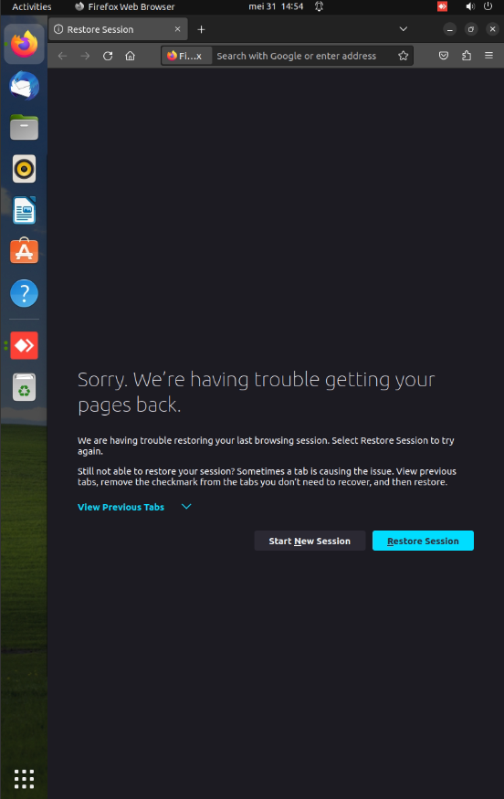
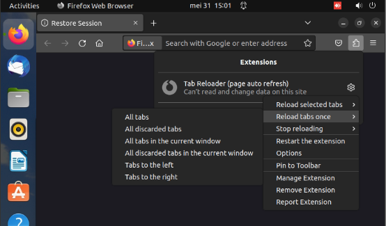
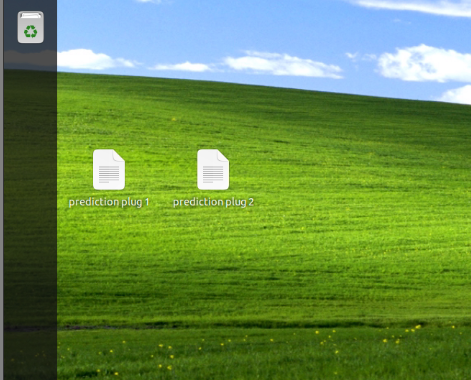

# Manual opstelling

## Opstarten opstelling

Na het opstarten van de opstelling wordt gebruik gemaakt van restore session om de verschillende dashboards op de correcte plaats te zetten.

  

Het is mogelijk dat toch niet alle dashboards correct staan na het gebruiken van restore session. Om dit op te lossen wordt gebruik gemaakt dit laat toe om vanop afstand toegang tot de pc te krijgen om alles goed te zitten. Om toegang tot de pc te krijgen moet je op het localAP netwerk zitten en verbinden met 192.168.12.1. Wanneer home assistant opgestart is kan gebruik gemaakt worden van de tab reloader extensie om alle tabladen tegelijk te herladen. Hiervoor wordt naar de instellingen van de extensie gegaan -> reload tabs once -> all tabs.

  

## Scripts

Wanneer alle dashboards correct opgestart zijn kunnen de scripts voor de plugs opgestart worden. De scripts zijn te vinden op het bureaublad en kunnen geactiveerd worden door twee maal te klikken. Wanneer een apparaat aangesloten op een plug moet zeker gemaakt worden dat het verbruikt omdat een onderscheiding tussen normaal en sluimerverbruik gemaakt wordt aan de hand van de gemeten waarden. Om de scripts te resetten moet de plug aangezet worden en het apparaat uitgehaald worden.

  

