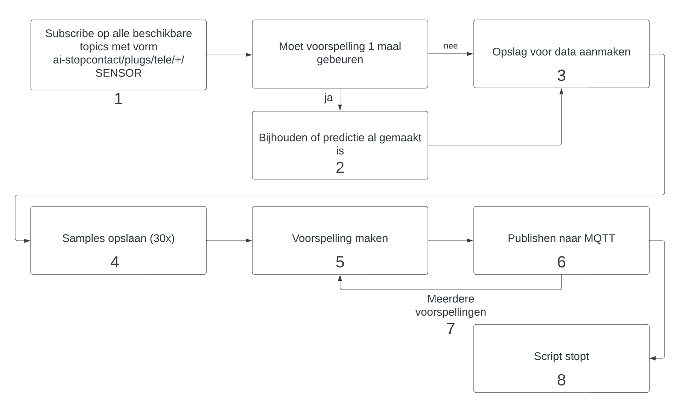
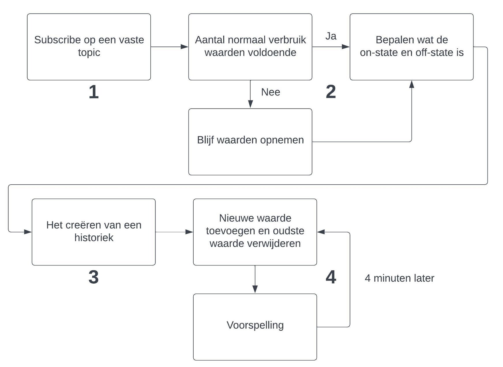
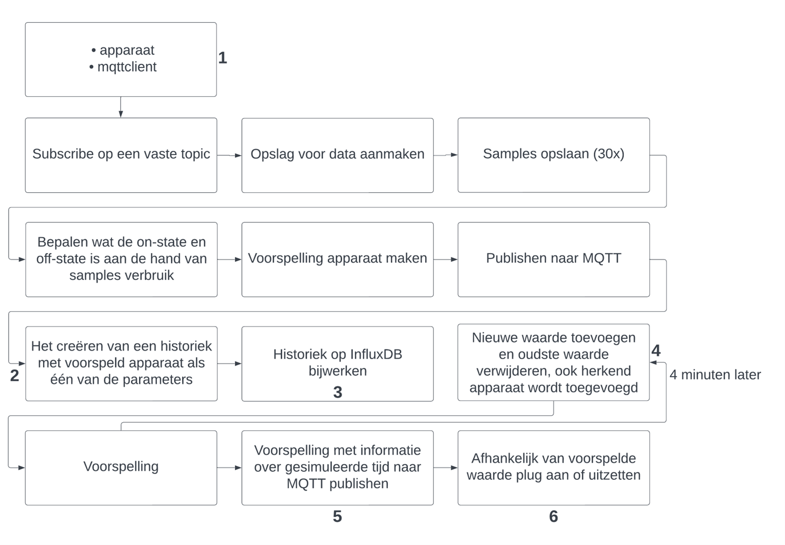

# Korte uitleg over notebooks & scripts

## Notebooks

### Classfication [[notebook-classifcation]](../notebooks/classification_device.ipynb)

Dit notebook wordt gebruikt om een classificatie model te trainen. Dit model wordt gebruikt in het classificatie script om apparaten te herkennen.

### Prediction state [[notebook-prediction-state]](../notebooks/prediction_state2devices.ipynb)

Dit notebook wordt gebruikt om een LSTM model te trainen. Aan de hand van dit model kan een state van een apparaat voorspeld worden (aan of uit). Deze kan getraind worden op twee patronen, één voor een box en één voor een laptop.

## Scripts

### Classificatie script [[classification-script]](../scripts/classification.py)

Het classificatie script haalt aan de hand van mqtt samples van een broker. Van zodra dat er genoeg samples ontvangen zijn kan het een predictie maken. Deze predictie wordt vervolgens teruggestuurd naar een subtopic van de topic waarvan de data komt. Deze predictie kan éénmaal of meerdere malen uitgevoerd worden.

  

### State predictie script [[prediction-script]](../scripts/Prediction_script_New/mqtt_prediction_script.py)

Dit script kan aan de hand van een historiek voor een apparaat een voorspelling maken van de state van dat apparaat.

  

### Combinatie script !!!!hier nog verwijzen naar het combinatie script en hier ook plaatsten welke modellen er gebruikt zijn en de scaler!!!!!

Dit script combineerd de classificatie en voorspelling met elkaar. In dit script wordt het herkende apparaat gebruikt voor de voorspelling van de state.

  

### Always off script [[always-off-script]](../scripts/always_off.py)

Aan de hand van dit script kan in een dataset gekeken worden op welke uren het apparaat gewoonlijk altijd uitstaat. Het is mogelijk om de bekomen uren naar mqtt te sturen zodat ze vervolgens door een andere applicatie gebruikt kunnen worden.
