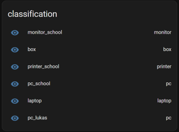
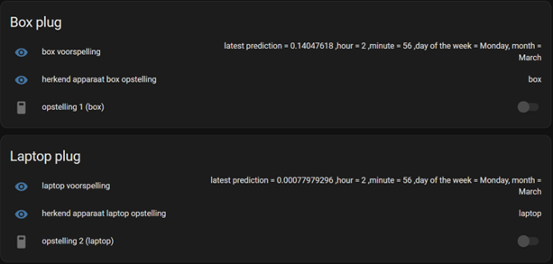
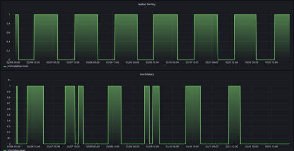
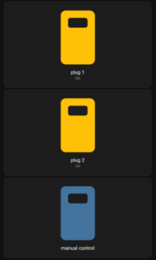

# Opstelling

## Setup

### lokaal wifi network

Om een acess point op te zetten zonder een internetverbinding wordt gebruik gemaakt van create_ap. create_ap kan op de volgende wijze geïnstalleerd worden.

```txt
git clone https://github.com/oblique/create_ap
cd create_ap
make install
```

Om ervoor te zorgen dat bij het opstarten van de pc automatisch een access point opgezet wordt moet in het /usr/lib/systemd/system/create_ap.service bestand het execstart commando aangepast worden naar een commando van het volgende type '/usr/bin/create_ap -n "interface" "AP naam" "wachtwoord"'.

## Touchscreen

Om het touchscreen te gebruiken moet het ten eerste verbonden met het te bedienen apparaat.
Volg voor de initiele instelling de volgende [guide](https://joy-it.net/files/files/Produkte/RB-LCD10-2/RB-LCD-10-2%20Manual-A6%2026-02-20.pdf).
Vervolgens moeten aan de instellingen uit de guide enkele aanpassingen gemaakt worden. De gecalibreerde coördinaten in /usr/share/X11/xorg.conf.d/99-calibration.conf moeten verwijderd worden en de swapaxes option moet ook verwijderd worden. Vervolgens moet de volgende lijn toegevoegd worden aan /usr/share/X11/xorg.conf.d/99-calibration.conf Option "TransformationMatrix" "0 -1 1 1 0 0 0 0 1". Ten laatste moet er nog voor gezorgd worden dat ubuntu xorg en niet wayland gebruikt. Hiervoor moet automatisch inloggen eerst uitgeschakeld worden. Op ubuntu is dit te vinden onder instellingen -> users. Log vervolgens uit en klik bij het inloggen op het tandwiel en selecteer xorg.

### touchscreen met twee schermen

Om ervoor te zorgen dat het touchscreen werkt met twee schermen wordt bij opstarten het touchscreen.sh script uitgevoerd. Het wordt uitegevoerd aan de hand van "startup application" in Ubuntu. Het script bevat één simpel commando namelijk 'xinput map-to-output "id" "output"'. Het correcte id kan gevonden worden aan de hand van het xinput commando en de output parameter is bijvoorbeeld HDMI-1.

## Dashboard

### Classificatie dashboard



Het classificatie dashboard wordt gebruikt om te tonen welk apparaat het classificatie script herkend en welk apparaat zou moeten herkend worden.

### Voorspelling dashboard



Op het voorspelling dashboard wordt getoond welke waarde momenteel voorspeld wordt, welk apparaat herkend werd en of het stopcontact momenteel aan of uit staat.

### Historiek dashboard



Het historiek dashboard is een grafana dashboard dat gebruikt wordt om de historiek van de twee apparaten uit de simulatie te tonen.

### Manuele controle dashboard



Het manuele controle dashboard is een dashboard dat gebruikt wordt om de stopcontacten manueel aan te sturen en dus het automatisch aan- en uitgaan uit te schakelen.
