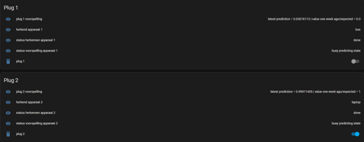
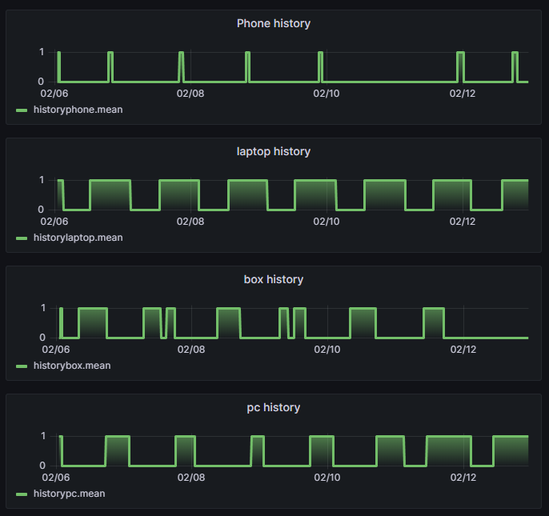

# Opstelling

## Setup

### Lokaal wifi network

Om een access point op te zetten zonder een internetverbinding, wordt gebruik gemaakt van 'create_ap'. 'create_ap' kan op de volgende wijze geïnstalleerd worden.

```txt
git clone https://github.com/oblique/create_ap
cd create_ap
make install
```

Om ervoor te zorgen dat bij het opstarten van de pc automatisch een access point opgezet wordt moet in het **'/usr/lib/systemd/system/create_ap.service'**-bestand het **execstart-commando** aangepast worden naar een commando van het volgende type.

```txt
/usr/bin/create_ap -n "interface" "AP naam" "wachtwoord"
```

### Remote access

Doordat de opstelling op een lokaal netwerk zit, kan er moeilijk remote access gebeuren met TeamViewer. Daardoor maken we gebruik van AnyDesk, om een remote access te krijgen van de opstelling. Op die manier kunnen we ook de dashboards op zijn plaats zetten.

Hiervoor zal je nog **AnyDesk** moeten installeren via [deze link](https://anydesk.com/nl)

### Touchscreen

Om het touchscreen te gebruiken moet het ten eerste verbonden zijn met het te bedienen apparaat.
Volg voor de initiële instelling de volgende [guide](https://joy-it.net/files/files/Produkte/RB-LCD10-2/RB-LCD-10-2%20Manual-A6%2026-02-20.pdf).

Vervolgens moeten aan de instellingen uit de guide enkele aanpassingen gemaakt worden. De gecalibreerde coördinaten moeten in de onderstaande file verwijderd worden en de **swapaxes option** moet ook verwijderd worden.

```txt
/usr/share/X11/xorg.conf.d/99-calibration.conf
```

Vervolgens moet de volgende lijn toegevoegd worden aan aan deze file.

```txt
Option "TransformationMatrix" "0 -1 1 1 0 0 0 0 1"
```

Ten laatste moet er nog voor gezorgd worden dat ubuntu **xorg** gebruikt en **NIET** wayland. Hiervoor moet automatisch inloggen eerst uitgeschakeld worden. Op ubuntu is dit te vinden onder **instellingen -> users**. Log vervolgens uit en **klik bij het inloggen op het tandwiel en selecteer xorg**.

### Touchscreen met twee schermen

Om ervoor te zorgen dat het touchscreen werkt met twee schermen, wordt bij het opstarten het **touchscreen.sh-script** uitgevoerd. Het wordt uitegevoerd aan de hand van **startup application** in Ubuntu. Het script bevat één simpel commando namelijk:

```txt
xinput map-to-output "id" "output"
```

Het correcte id kan gevonden worden aan de hand van het **xinput**-commando en de output parameter is bijvoorbeeld HDMI-1.

**LET OP: ALS JE DE KABEL VERWISSELD VAN POORT, ZAL DE ID OOK VERANDEREN**

## Dashboard

### Classificatie dashboard

Het classificatie dashboard wordt gebruikt om te tonen welk apparaat het classificatie script herkend en welk apparaat zou moeten herkend worden.

<p align="center">
  
</p>

### Voorspelling dashboard

Op het voorspelling dashboard wordt getoond welke waarde momenteel voorspeld wordt, welk apparaat herkend werd en of het stopcontact momenteel aan of uit staat.

<p align="center">
  
</p>

### Historiek dashboard

Het historiek dashboard is een grafana dashboard dat gebruikt wordt om de historiek van de twee apparaten uit de simulatie te tonen.

<p align="center">
  
</p>

### Manuele controle dashboard

Het manuele controle dashboard is een dashboard dat gebruikt wordt om de stopcontacten manueel aan te sturen en dus het automatisch aan- en uitgaan uit te schakelen.

<p align="center">
  
</p>
