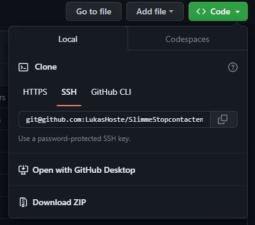
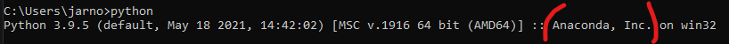

# Installatie en uitvoering

In dit document wordt de volledige uitvoering en installatie van onze bachelorproef uitgelegd.

# 1. Installatie

## 1.1 Hoe Github installeren en de repository te clonen

Om de code van github te halen moet er eerst de ssh key van je apparaat op github toegevoegd worden. Indien je nog geen ssh key hebt, kan deze gegeneerd worden aan de hand van de onderstaande commando.

```txt
ssh-keygen 
```

Vervolgens kan je aan de hand van de onderstaande commando je ssh key kopiëren. Hierbij moet de **locatie bestand** nog vervangen worden naar de locatie waar de **.ssh** folder terug te vinden is.

```txt
cat [locatie bestand]/.ssh/id_rsa.pub
```

Op windows bevind het bestand zich in de user directory en op linux in de home directory. Vervolgens moet deze key toegevoegd worden op github onder settings **SSH and GPG keys**, selecteer hier **new ssh key** en plak je EIGEN key. Nu de key toegevoegd is, moet git nog geïnstalleerd worden zodat de code opgehaald kan worden.

1. Op windows kan git geïnstalleerd worden via de [volgende link](https://git-scm.com/download/win).

2. Op Linux kan het geïnstalleerd worden met het volgende commando.

```txt
sudo apt install git
```

Om code van github te “clonen” kan nu op een repository op de code knop gedrukt worden waarna op ssh geklikt worden en de gegenereerde string kan gekopieerd worden.



Aan de hand van het onderstaand commando kan de code opgehaald worden. In de **gekopieerde string** komt hetgene die in de afbeelding bovenaan terug te vinden is.

```txt
git clone [gekopieerde string]
```

## 1.2 Python installatie

Eerst zal voor de code uit te voeren python moeten geïnstalleerd zijn.

1. Python installeren voor Windows kan volgens [deze webpagina](https://www.python.org/downloads/).

2. Python installeren voor linux kan volgens [deze webpagina](https://docs.python-guide.org/starting/install3/linux/).

## 1.3 Pip installatie

Pip wordt gebruikt om de modules/packages te installeren.

1. Pip installeren voor Windows kan via de [volgende link](https://phoenixnap.com/kb/install-pip-windows)

2. Pip installeren voor Linux kan via de [volgende link](https://www.redhat.com/sysadmin/install-python-pip-linux)

## 1.4 Miniconda installatie

Miniconda is **NIET EEN MUST-HAVE**, maar dit kan wel een voordeel zijn als je verschillende versies van modules/packages wilt gaan gebruiken.

Eerst zal Miniconda moeten geïnstalleerd worden en dit kan volgens de [volgende link](https://docs.conda.io/en/latest/miniconda.html#:~:text=On%20Windows%2C%20macOS%2C%20and%20Linux,which%20does%20require%20administrator%20permissions.). Om na te gaan of de installatie gelukt is, kan dit via de terminal.



Daarna kan miniconda gebruikt worden. Eerst moet er gekeken worden om een conda enviroment aan te maken. Dit kan via de onderstaande commando. Hierbij moet nog de **env_name** vervangen worden door een eigen gekozen naam van environment. Ook moet de **version** aangepast worden naar de versie van python dat gebruikt wil worden.

```txt
conda create --name env_name python=version
```

Daarna is de conda environment aangemaakt en kan je via het volgend commando dit gaan activeren.

```txt
conda activate env_name
```

Wanneer de conda environment geactiveerd is, kunnen nu modules/packages geïnstalleerd worden die **enkel** op deze environment gebruikt kan worden.

Om uit de environment te gaan, kan gebruik gemaakt worden van het volgende commando.

```txt
conda deactivate
```

## 1.5 Requirements.txt file installatie

**DEZE FILE IS NIET EEN MUST-HAVE!** Wanneer je het model zou willen laten trainen, gaat het hoogst waarschijnlijk niet automatisch trainen op de GPU. Door deze txt-file te installeren, zou dit ervoor moeten zorgen dat het zal trainen op de GPU. Deze file bevat namelijk verschillende versies van packages en modules.

Om deze te installeren raden we aan om dit uit te voeren in een **apart conda environment**. Daarna moet u deze file lokaal hebben en het installeren kan volgens de onderstaande commando.

```txt
pip install -r requirements.txt
```

Om na te gaan of de packages correct geïnstalleerd zijn, kan je het volgende commando uitvoeren.

```txt
conda list
```

# 2. Uitvoering

## 2.1 Trainen modellen

Onder notebooks kunnen de jupyter notebooks gevonden worden die gebruikt werden voor het trainen van de twee AI-modellen.

### 2.1.1 Trainen van het classificatie model

Voor het herkennen van apparaten wordt het … notebook gebruikt. Om dit notebook uit te voeren moet ten eerste python geïnstalleerd zijn. Vervolgens moeten modules geïnstalleerd worden die te vinden zijn in de onderstaande tabel.

```txt
python -m pip install -U matplotlib
pip3 install numpy
pip3 install joblib
pip3 install pandas
pip3 install tensorflow
pip3 install -U scikit-learn
```

Om het model te trainen kan gebruik gemaakt worden van eigen data of van onze data. Om gebruik te maken van eigen data moet de bestandslocatie in de volgende twee lijnen code aangepast worden.

```python
for file in os.listdir("../data/28-03+afstands"):

df = pd.read_csv("../data/28-03+afstands/" + objectClass + ".csv")
```

Daarnaast moet het voldoen aan de structuur zoals in onze data. Indien je over meer of minder data beschikt is het een goed idee om de SAMPLES_PER_CLASS parameter respectief te verhogen of te verlagen. Ook kan het nodig zijn dat het aantal neuronen, de batch size, de dropout en het aantal epochs voor optimale prestatie van het model moeten aangepast worden.

### 2.1.2 Trainen van gebruikersgedrag model

Voor het voorspellen van een gebruikersgedrag wordt het … notebook gebruikt. Om dit model te runnen, moeten de onderstaande modules geïnstalleerd zijn.

```txt
python -m pip install -U matplotlib
pip3 install numpy
pip3 install joblib
pip3 install pandas
pip3 install tensorflow
pip3 install -U scikit-learn
```

Om eigen data te gebruiken moeten de onderstaande lijnen code aangepast worden, waarbij de **own_file** zal moeten vervangen worden naar de naam van de eigen dataset.

```python
df_pc = load_data(r'../data/multiple_devices/new_weeks/[own_file].csv')
df_box = load_data(r'../data/multiple_devices/new_weeks/[own_file].csv')
```

Indien de historiek kleiner is dan een week of verspringt met een grotere of kleinere time step moet de waarde van de ‘time_steps’ variabele aangepast worden. Om het model optimaal te laten werken kunnen de lagen, het maken van de slope, de learning rate en de batch size aangepast worden.

## 2.2 Uitvoeren van scripts

Voor het uitvoeren van de scripts moeten ten eerste de onderstaande modules geïnstalleerd worden. Deze modules kunnen geïnstalleerd worden aan de hand van pip of pip3.

```txt
pip3 install numpy
pip3 install joblib
pip3 install pandas
pip3 install tensorflow
pip3 install scikit-learn
pip3 install paho-mqtt
pip3 install influxdb
pip3 install python-dotenv
```

Vervolgens kunnen de scripts simpel uitgevoerd worden aan de hand van het onderstaande commando.

```txt
python3 [naam script]
```

Om het combinatie script uit te voeren met argumenten moet het commando gewijzigd worden aan de hand van het help commando.

```txt
python3 [naam script] –help
```

In de verschillende scripts kunnen de modellen aangepast worden door in de onderstaande lijnen code het pad naar het model aan te passen.

```python
model = keras.models.load_model('/[own_path]/[model_folder]')
classification_model = keras.models.load_model('/[own_path]/[model_folder')
```

Belangrijk bij het gebruiken van een ander model is dat hierbij ook de scaler moet aangepast worden. Dit kan aangepast worden in de onderstaande lijnen.

```python
scaler = joblib.load('/[own_path]/[scaler_name].gz')
classification_scaler = joblib.load('/[own_path]/[scaler_name].gz')
```

In de scripts die een voorspelling maken kan de historiek die gebruikt wordt voor de simulatie aangepast worden in één van de onderstaande lijnen.

```python
df_history = pd.read_csv(r'/[own_path]/[own_history].csv', parse_dates=['timestamp'])
```

**Om dit script uit te voeren moet rekening gehouden worden met de MQTT-broker. Je moet namelijk je eigen MQTT-broker installeren waarnaar de smartplugs hun data kunnen versturen. In de scripts moet vervolgens het broker address aangepast worden.**
